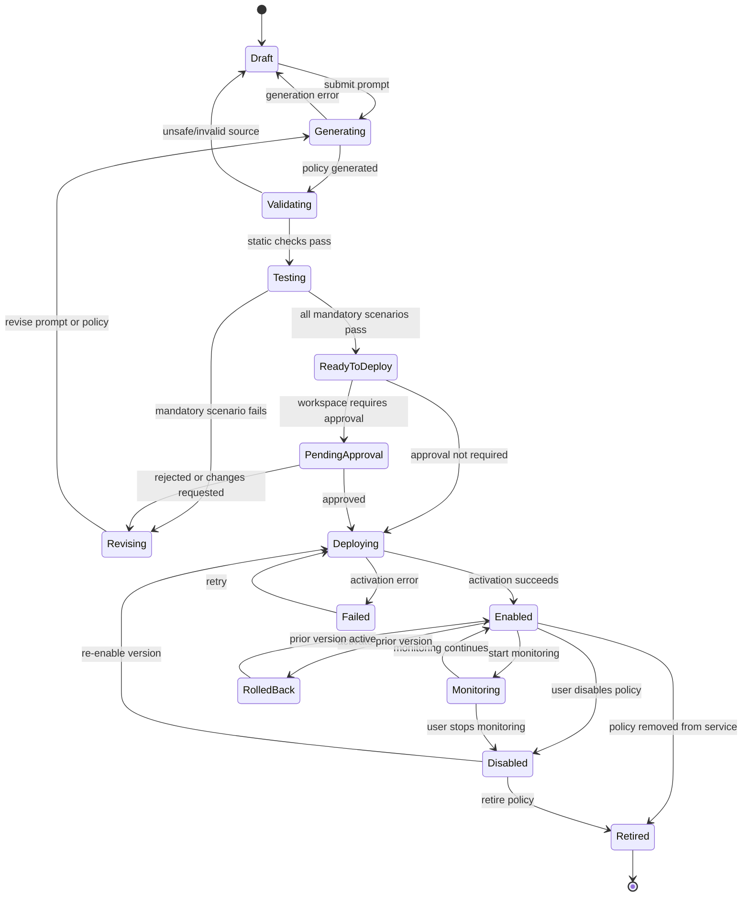
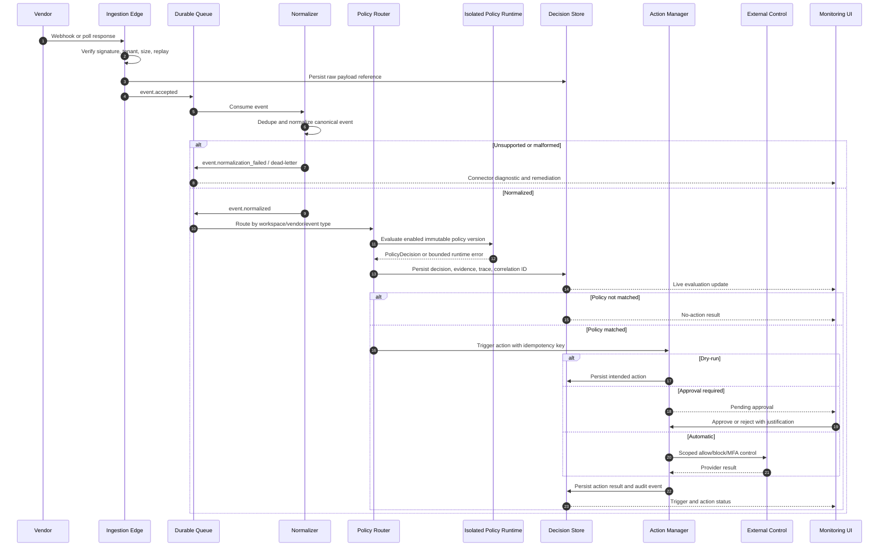

# Activity Policy Control Plane — Architectural Flow Diagram

This diagram describes the complete runtime and control-plane flow. It includes the four user-facing areas—Vendors, Policy Agent, Deployed Policies, and Actions—and the supporting security, data, queue, runtime, and observability paths.

## 1. End-to-end architecture flow

```mermaid
flowchart TB
    %% -------------------------
    %% People and user interface
    %% -------------------------
    subgraph USERS[Users and external systems]
        U[Security engineer / administrator / analyst / auditor]
        UI[Web dashboard\nVendors | Policy Agent | Deployed Policies | Actions]
        IDP[OIDC / SAML identity provider]
        VENDORS[Connected vendors\nGitHub | GitLab | AWS | Azure | GCP | Jira | Trello | Okta]
        MAIL[Email / notification provider]
    end

    U -->|HTTPS| UI
    UI -->|Login / token| IDP
    IDP -->|Identity claims| UI

    %% -------------------------
    %% Control plane
    %% -------------------------
    subgraph CONTROL[Control plane]
        API[API gateway / FastAPI\nTLS, rate limits, request validation]
        AUTH[AuthN/AuthZ middleware\nworkspace isolation, RBAC, approval checks]
        AUDIT[Audit writer\nappend-only lifecycle records]
        SSE[SSE notification service\nlive dashboard updates]
        AGENT[Policy Agent orchestrator\nintent extraction, generation, revision loop]
        CONNECTOR[Connector manager\nconfiguration, capabilities, tests, diagnostics]
        ACTIONS[Action manager\nallow, block, MFA, escalate, approval]
    end

    UI --> API
    API --> AUTH
    AUTH -->|authorized request| CONNECTOR
    AUTH -->|authorized request| AGENT
    AUTH -->|authorized request| ACTIONS
    AUTH -->|authorized request| AUDIT
    API --> SSE
    SSE --> UI

    %% -------------------------
    %% Secrets and persistence
    %% -------------------------
    subgraph DATA[Data and secret boundaries]
        DB[(PostgreSQL\nworkspace state, policies, decisions, actions)]
        OBJ[(Encrypted object storage\nraw payloads, source, evidence)]
        SECRETS[(OpenBao\ncredential values only)]
        SCHEMA[Versioned contracts\nNormalizedEvent / PolicyDecision]
    end

    CONNECTOR -->|redacted config metadata| DB
    CONNECTOR -->|secret reference only| SECRETS
    AGENT -->|drafts, versions, tests| DB
    ACTIONS -->|definitions, approvals, outcomes| DB
    AUDIT --> DB
    SCHEMA --> CONNECTOR
    SCHEMA --> AGENT

    %% -------------------------
    %% Vendor onboarding path
    %% -------------------------
    subgraph ONBOARD[Vendor onboarding and connection health]
        CONFIG[User enters vendor config\nOAuth/PAT/API key, org/project, event types]
        TEST[Staged connection test\ncredentials -> reachability -> scopes -> subscription -> sample event]
        HEALTH{Connection result}
        CONNECTED[Connected / enabled\nstart webhook or polling]
        DEGRADED[Degraded\nmissing scope, no activity, unsupported event, or normalization issue]
        DISABLED[Disabled\nstop ingestion, preserve history]
        GUIDE[Remediation guide\nexact permission + exact test activity]
    end

    UI --> CONFIG
    CONFIG --> CONNECTOR
    CONNECTOR --> TEST
    TEST --> HEALTH
    HEALTH -->|all required checks pass| CONNECTED
    HEALTH -->|auth/scope/activity/capability issue| DEGRADED
    DEGRADED --> GUIDE
    GUIDE -->|fix and re-test| TEST
    UI -->|enable / disable| CONNECTOR
    CONNECTOR --> DISABLED
    CONNECTOR --> CONNECTED
    CONNECTED --> VENDORS
    CONNECTOR --> DB

    %% -------------------------
    %% Ingestion and normalization
    %% -------------------------
    subgraph INGEST[Event ingestion pipeline]
        WEBHOOK[Webhook edge\nverify signature, size, replay, tenant]
        POLLER[Poll scheduler / worker\ncursor, rate limit, backoff]
        RAW[Persist raw event\nchecksum, source ID, payload reference]
        DEDUPE{Duplicate?}
        NORMALIZE[Normalize vendor payload\ncanonical event schema]
        VALID{Valid and supported?}
        ACCEPT[event.accepted / event.normalized]
        DLQ[Dead-letter / error queue\noperator replay or remediation]
        CURSOR[(Ingestion cursor / watermark)]
    end

    VENDORS -->|signed webhook| WEBHOOK
    VENDORS -->|API poll| POLLER
    CONNECTED --> WEBHOOK
    CONNECTED --> POLLER
    WEBHOOK -->|durable accept| RAW
    POLLER -->|durable accept| RAW
    POLLER --> CURSOR
    RAW --> OBJ
    RAW --> DEDUPE
    DEDUPE -->|yes: count and ignore reprocessing| ACCEPT
    DEDUPE -->|no| NORMALIZE
    NORMALIZE --> SCHEMA
    NORMALIZE --> VALID
    VALID -->|yes| ACCEPT
    VALID -->|no: malformed / unsupported| DLQ
    WEBHOOK -->|invalid signature / replay| DLQ
    POLLER -->|provider timeout / 429| DLQ
    ACCEPT --> DB

    %% -------------------------
    %% Policy creation and deployment path
    %% -------------------------
    subgraph POLICY[Policy Agent and deployment lifecycle]
        PROMPT[User prompt + source events + timezone + exclusions + severity/action]
        INTENT[Extract structured intent\nrequired event types/fields and assumptions]
        GENERATE[Generate Python policy artifact\nsource, metadata, test cases]
        STATIC{Static safety validation}
        SCENARIOS[Positive, negative, boundary, exclusion, malformed, duplicate cases]
        TESTRUN[Isolated policy test runner\nCPU/memory/time/import limits]
        RESULTS{All mandatory tests pass?}
        REVISE[Show failure, ambiguity, trace\nand revise prompt/policy]
        READY[Ready to deploy\nimmutable hash + evidence]
        APPROVAL{Approval required?}
        PENDING[Pending approval]
        DEPLOY[Create deployment\nregister event subscriptions]
        ENABLED[Enabled policy version]
        ROLLBACK[Rollback / disable\nkeep prior version available]
    end

    UI --> PROMPT
    PROMPT --> AGENT
    AGENT --> INTENT
    INTENT --> GENERATE
    GENERATE --> STATIC
    STATIC -->|fail| REVISE
    STATIC -->|pass| SCENARIOS
    SCENARIOS --> TESTRUN
    TESTRUN -->|isolated execution| RESULTS
    RESULTS -->|no| REVISE
    REVISE --> AGENT
    RESULTS -->|yes| READY
    READY --> APPROVAL
    APPROVAL -->|yes| PENDING
    PENDING -->|approved| DEPLOY
    PENDING -->|rejected| REVISE
    APPROVAL -->|no| DEPLOY
    DEPLOY --> ENABLED
    ENABLED --> DB
    ENABLED -->|disable / rollback| ROLLBACK
    ROLLBACK --> DB
    GENERATE --> OBJ
    TESTRUN --> DB

    %% -------------------------
    %% Runtime evaluation path
    %% -------------------------
    subgraph RUNTIME[Real-time policy evaluation]
        BUS[(Durable event bus\naccepted, normalized, decision, action topics)]
        ROUTER[Policy router\nworkspace + vendor + event type]
        MATCH[Enabled policy versions]
        SANDBOX[Isolated Python policy runtime\nno network, secrets, filesystem, subprocess]
        DECISION[Persist PolicyDecision\nmatched, severity, reason, evidence, trace]
        TRIGGER{Policy matched?}
        NOP[No action\nmonitoring update only]
    end

    ACCEPT --> BUS
    BUS --> ROUTER
    ROUTER --> MATCH
    MATCH --> SANDBOX
    SANDBOX -->|timeout / runtime error| DLQ
    SANDBOX --> DECISION
    DECISION --> DB
    DECISION --> TRIGGER
    TRIGGER -->|no| NOP
    TRIGGER -->|yes| ACTIONS
    NOP --> SSE

    %% -------------------------
    %% Action and response path
    %% -------------------------
    subgraph RESPONSE[Response and action path]
        ACTIONMODE{Configured mode}
        DRYRUN[Dry-run\nrecord intended action]
        NEEDAPPROVAL[Create approval task]
        EXECUTE[Execute scoped adapter\nprovider API / IdP / email]
        IDEMPOTENCY[Idempotency key + retry policy]
        ACTIONRESULT{Action result}
        SUCCESS[Action succeeded]
        FAILURE[Action failed\nretry or manual fallback]
        REVIEW[Reviewer approves/rejects\nwith justification]
    end

    ACTIONS --> ACTIONMODE
    ACTIONMODE -->|dry-run| DRYRUN
    ACTIONMODE -->|approval| NEEDAPPROVAL
    ACTIONMODE -->|automatic| IDEMPOTENCY
    NEEDAPPROVAL --> REVIEW
    REVIEW -->|approve| IDEMPOTENCY
    REVIEW -->|reject| FAILURE
    IDEMPOTENCY --> EXECUTE
    EXECUTE -->|block / MFA / escalation| VENDORS
    EXECUTE -->|email escalation| MAIL
    EXECUTE --> ACTIONRESULT
    DRYRUN --> ACTIONRESULT
    ACTIONRESULT -->|passed| SUCCESS
    ACTIONRESULT -->|transient failure| FAILURE
    FAILURE -->|bounded retry| IDEMPOTENCY
    FAILURE -->|permanent failure| DLQ
    SUCCESS --> DB
    FAILURE --> DB
    DRYRUN --> DB
    REVIEW --> DB

    %% -------------------------
    %% Cross-cutting observability
    %% -------------------------
    subgraph OPS[Cross-cutting security and operations]
        TRACE[OpenTelemetry\ncorrelation ID across request/event/evaluation/action]
        METRICS[Metrics and alerts\nlatency, lag, failures, drops, retries]
        LOGS[Structured redacted logs]
        RETENTION[Retention and deletion policies]
    end

    API --> TRACE
    CONNECTOR --> TRACE
    AGENT --> TRACE
    TESTRUN --> TRACE
    BUS --> TRACE
    SANDBOX --> TRACE
    ACTIONS --> TRACE
    TRACE --> METRICS
    TRACE --> LOGS
    METRICS --> UI
    DB --> RETENTION
    OBJ --> RETENTION
    SECRETS --> RETENTION

    AUDIT -. records every lifecycle change .-> CONFIG
    AUDIT -. records every lifecycle change .-> READY
    AUDIT -. records every lifecycle change .-> DECISION
    AUDIT -. records every lifecycle change .-> ACTIONRESULT

    classDef store fill:#eef,stroke:#446;
    classDef risk fill:#fee,stroke:#a44;
    class DB,OBJ,SECRETS,CURSOR,BUS store;
    class DLQ,DEGRADED,FAILURE risk;
```

## 2. Policy lifecycle state flow



## 3. Event and action sequence



## 4. Coverage checklist

The architecture explicitly includes the following required concerns:

| Concern | Covered in diagram |
|---|---|
| Sidebar/dashboard areas | Web dashboard and control-plane branches |
| Vendor credentials | Vendor onboarding, secret manager boundary, redacted metadata |
| Test Connection | Staged connection test with check-by-check result |
| Successful connection | Connected/enabled path to webhook/polling |
| Failed connection | Degraded path, remediation guide, retry/re-test |
| No incoming logs | Activity/capability diagnostics and generated test activity |
| Enable/disable vendor | Connected/disabled lifecycle |
| Raw event logs | Raw payload storage/object storage |
| Live ingestion | Webhook and polling paths |
| Duplicate events | Dedupe branch and duplicate metric |
| Normalized event model | Versioned canonical schema |
| Policy prompt | Prompt and intent extraction |
| Generated Python function | Artifact generation and isolated runtime |
| Test scenarios | Positive, negative, boundary, exclusion, malformed, duplicate |
| Agent revision loop | Failed tests return to revision/generation |
| Ready to Deploy | Readiness and approval/deployment branch |
| Deployed policy list | Enabled policy versions and database state |
| Enable/disable/rollback | Policy state flow |
| Real-time monitoring | SSE updates from decisions and action results |
| Allow | Action mode and adapter path |
| Block | Scoped vendor-control adapter |
| MFA | Identity-provider action adapter |
| Escalate | Email/notification provider path |
| Approval and dry-run | Response branch |
| Retries/idempotency | Action manager and queue failure paths |
| Audit | Append-only audit writer connected to lifecycle events |
| Security | Auth/RBAC, secret boundary, sandbox, signature checks |
| Observability | Correlation IDs, metrics, logs, alerts, retention |
| Recovery | Dead-letter queues, replay, retries, rollback |

## 5. Diagram implementation notes

- Solid arrows represent the normal data/control path.
- Dashed arrows represent cross-cutting audit writes.
- Red nodes represent degraded or failed paths that must remain visible to the user.
- Blue nodes represent durable state or message stores.
- The queue is intentionally between ingestion, normalization, evaluation, and action execution so each stage can retry independently.
- Raw events and generated policy source are retained separately from relational metadata so large payloads do not slow control-plane queries.
- The policy runtime is isolated from the API and action workers; generated code never receives vendor credentials or unrestricted network access.
- All paths carry `workspace_id` and `correlation_id` so tenant isolation and end-to-end investigation remain enforceable.
